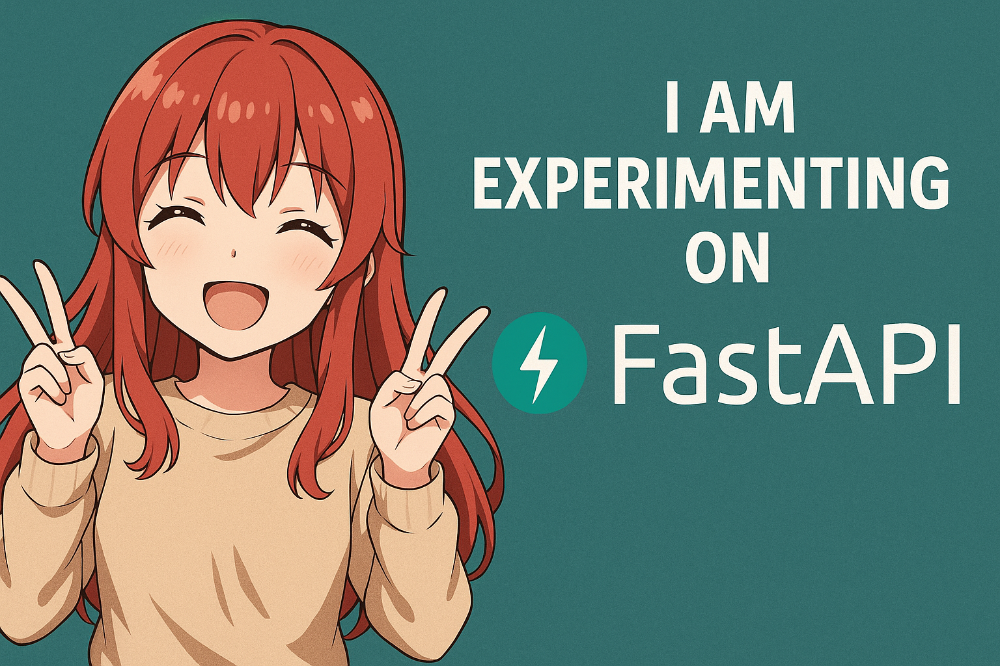

<!-- 👨‍💻 -->

Welcome to my GitHub profile! I'm a Python-powered **Web Developer** exploring the boundaries of backend, AI, and automation. Here you'll find personal projects, research ideas, experiments — and a few anime-inspired tech creations that reflect how I learn and build.

---

## 🚀 Highlights

- 🤖 **Bots & Automation:** From Discord bots like `Synthia` to GitHub automation like `LumaBot` — I build tools that interact, thank, and automate with charm.

- 🕸️ **Web Dev:** Functional and dynamic APIs built with Django, Flask, and FastAPI — always backend-first, always minimal.

- 🧪 **AI Research:** A research initiative combining LSTM + CNN models to analyze imbalanced data and detect advanced persistent threats.

- 🎨 **AI Art & Generators:** I occasionally use AI to generate art inspired by minimalism and anime. Some visual experiments live on [DeviantArt](https://www.deviantart.com/rakin235).

---

## 🔧 Tech Toolbox

- **Languages:** Python, JavaScript, SQL  
- **Frameworks:** Django, Flask, FastAPI  
- **Databases:** PostgreSQL, SQLite  
- **Skills:** REST APIs, Web Scraping, Bot Development, Docker (Learning)

---

## 📦 Featured Projects

### 🔍 APT Detection System  
LSTM + CNN hybrid model for detecting stealthy cyber threats. Tackles challenges like imbalanced data and long-term dependencies.

### 📤 Python Web Scrapers  
A toolbox of CLI/utility-based scrapers for collecting structured data from various sites.

### 🌐 Dynamic Web Apps  
Full-stack backend APIs using Django REST Framework, Flask microservices, and lightweight UI components.

---

## 📚 Learning Focus

- 📈 Master AI-powered decision systems in cybersecurity  
- 🔄 Use Docker & NGINX to containerize and deploy backend APIs  
- 🌱 Explore socket programming through anime-inspired projects  
- 💬 Continue developing my GitHub and Discord bots

---

## 🌸 Side Interests

- 🎀 Mascot-driven development: I design projects around characters like `Sayuri`, `Luma`, and `Synthia`, who act as virtual helpers in my tools.
- ☕ Urban gardening + simulation games.
- 🐾 A quiet dream of a home filled with cats, coffee, and stories.

---

## 🌐 Social & Platforms

- Codeforces – [rakinsp](https://codeforces.com/profile/rakinsp)  
- Codeberg – [@rakin235](https://codeberg.org/rakin235)  
- Stack Overflow – [@rakin235](https://stackoverflow.com/users/16396049/rakin235?tab=profile)  
- LeetCode – [rakin54](https://leetcode.com/rakin54/)  
- DeviantArt – [@rakin235](https://www.deviantart.com/rakin235)  
- Bluesky – [@rakin235.bsky.social‬](https://bsky.app/profile/rakin235.bsky.social)  

<!-- - Kaggle – Coming soon -->

---

## 🤝 Let’s Collaborate

<!-- Whether you're building tools, researching security, or just want to nerd out over anime-themed bots — I’m always up for conversations and collabs. -->

I'm creating mascot-driven developer tools — bots and apps with anime-style personalities.
Many mascots were initially prototyped with AI, but I'd love to bring them to life with real collaborators!

🧩 Looking for:

  -  🎨 Artists for character designs

  -  💻 Developers into bots & backend

  -  ✍️ Writers for dialog and style

[Projects Include](projects.md)

📩 You can reach me:
- via [Discord](https://discord.com/users/rakin235)
- or open an [issue on GitHub](https://github.com/rakinplaban/rakinplaban/issues) if you'd like to team up!

---

## 💫 GitHub Stats

*This anime art rotates every 15 minutes — a surprise each time you visit 🌸.*

<!-- GitHub Stats Temporarily Hidden  

-->

### 🔝 Top Contributed Repos

---

## 👁️ Profile View Counter

